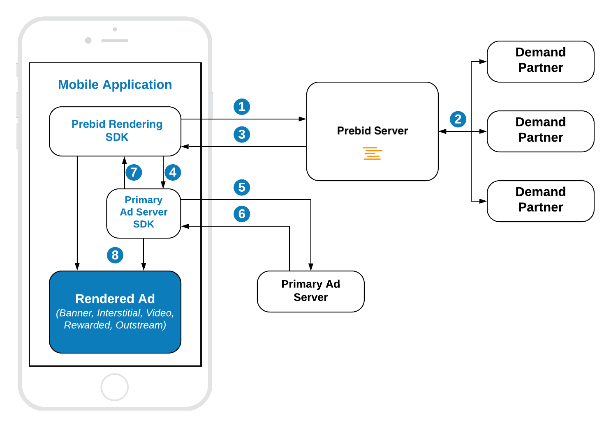
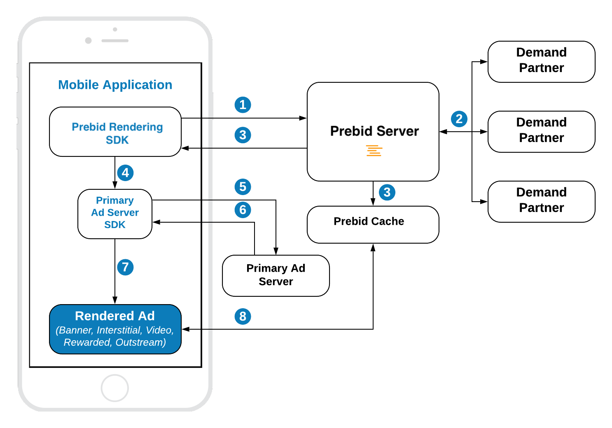

# Getting started with In-App Bidding


Prebid Rendering SDK provides access to the header bidding power. It allows publishers to increase the revenue by running a parallel auction on the server-side, inject the winning bid into the predefined waterfall and render premium ad formats with the best quality according to the latest industry standards.

## Integration Scenarios

There are three integration scenarios supported by Prebid Rendering SDK.

- **With Primary Ad Server** when the winning bid is rendered by Prebid Rendering SDK but other ads are rendered by Primary Ad Server SDK.
- **Pure In-App Bidding** when there is no Primary ad server and the winning bid is rendered right after an auction on Prebid.
- **Prebid Universal Creative Integration** when the winning bid is rendered by Prebid Universal Creative.

Below you can find their description and select the most suitable for your application.

  
### Prebid Rendering SDK with Primary Ad Server



1. Prebid Rendering SDK sends the bid request to the Prebid server.
2. Prebid server runs the header bidding auction among preconfigured demand partners.
3. Prebid Server responses with the winning bid that contains targeting keywords.
4. Prebid Rendering SDK sets up the targeting keywords of the winning bid to the ad unit of Primary Ad Server SDK.
5. Primary Ad Server SDK sends the ad request to the primary Ad Server
6. Primary Ad Server responds with an ad
7. The info about the winning ad is passed to the Prebid Rendering SDK
8. Depending on the ad response Prebid Rendering SDK renders the winning bid or allows Primary Ad Server SDK to show its own winning ad.

### Pure In-App Bidding


1. Prebid Rendering SDK sends the bid request to the Prebid server.
2. Prebid server runs the header bidding auction among preconfigured demand partners.
3. Prebid Server responses with the winning bid that contains targeting keywords.
4. Prebid Rendering SDK renders the winning bid.


### Prebid Universal Creative Integration



1. Prebid Rendering SDK sends the bid request to the Prebid server.
2. Prebid server runs the header bidding auction among preconfigured demand partners.
3. Prebid Server responses with the winning bid that contains targeting keywords.
4. Prebid Rendering SDK sets up the targeting keywords of the winning bid to the ad unit of Primary Ad Server SDK.
5. Primary Ad Server SDK sends the ad request to the primary Ad Server
6. Primary Ad Server responds with an ad
7. Primary Ad Server SDK loads the ad with Prebid Universal Creative into the WebView
8. Prebid Universal Creative loads the winning bid from the Prebid Cache and renders it.


## Supported Ad Formats

Prebid Rendering SDK supports next ad formats:

 - Display Banner
 - Display Interstitial
 - Video Interstitial
 - Rewarded Video
 - Outstream Video (for GAM and Pure In-App Bidding)
 - Native Styles Ads
 - Native Ads

## Prebid Setup

To start running header bidding auction you need to register on Prebid and create respective configurations for organization and ad units.

Before integrating the Prebid Rendering SDK you will need next keys:

- **Prebid Account ID** - an identifier of the **Stored Request**.
- **Configuration ID** - an identifier of the **Stored Impression** which contains information about bidders for a particular ad unit. You need as many ids as many different ad units you want to integrate.


## Init Prebid Rendering SDK

Firstly [integrate](android-sdk-integration.md) the Prebid Rendering SDK.

Then provide the **Prebid Account ID** of your organization. The best place to do it is the `onCreate()` method of your Application class.

```
PrebidRenderingSettings.setBidServerHost(HOST)
PrebidRenderingSettings.setAccountId(YOUR_ACCOUNT_ID)
```

## Integration Scenarios and Tips


Depending on Primary Ad Server used, In-App Bidding SDK supports these kinds of integration:

- With [Google Ad Manager (GAM)](integration-gam/android-in-app-bidding-gam-info.md) as a Primary Ad Server
- With [MoPub](integration-mopub/android-in-app-bidding-mopub-info.md) as a Primary Ad Server
- [Pure In-App Bidding](integration-prebid/android-in-app-bidding-pb-info.md) integration without Primary Ad Server
  

## Integration Tips


**Integration Features and Tips:**
- [Testing and troubleshooting](android-sdk-self-test.md)


