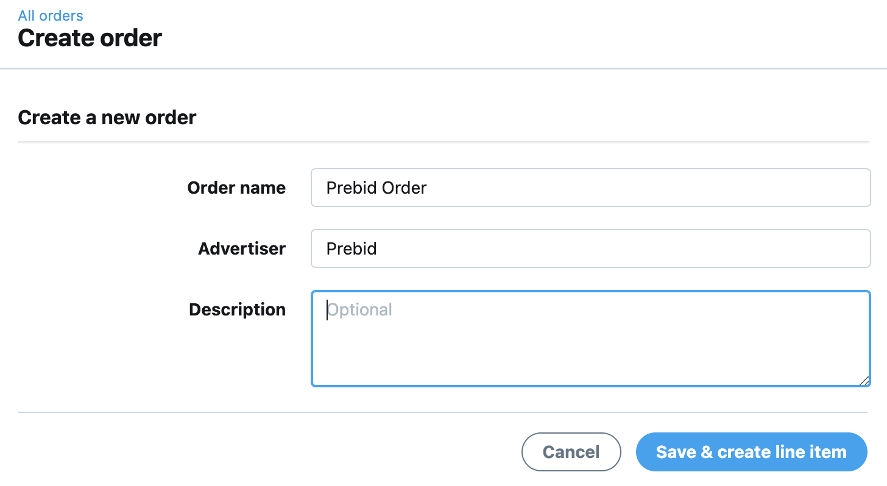
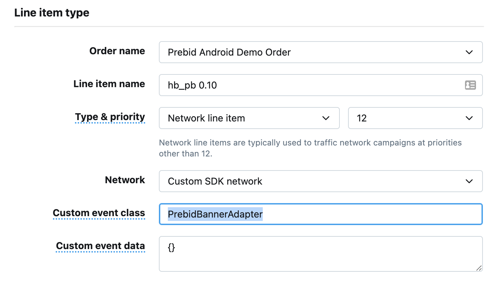
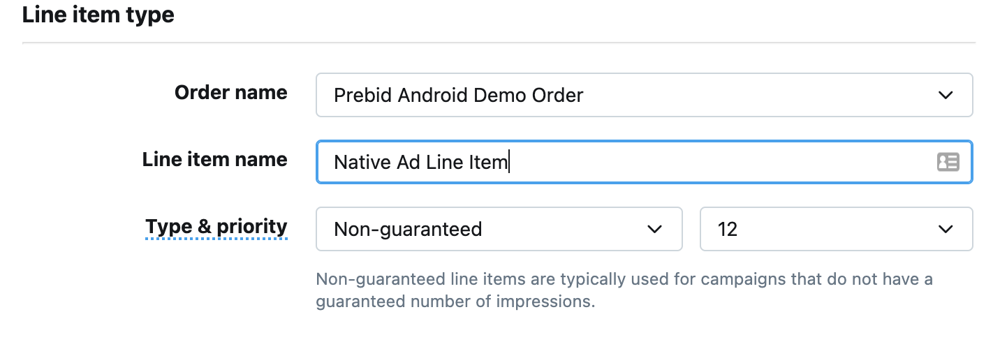
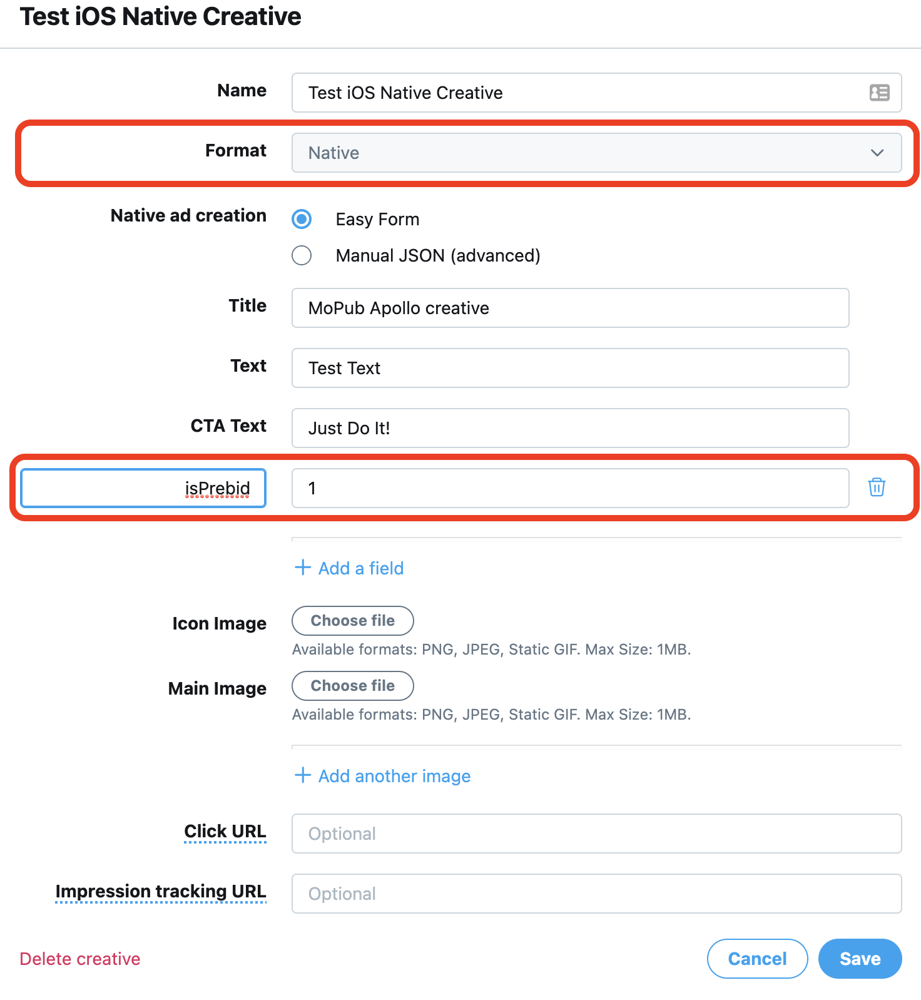
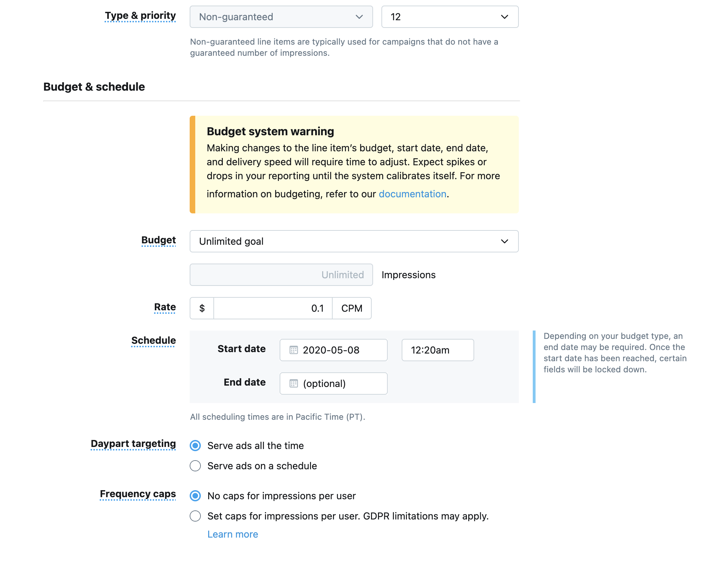
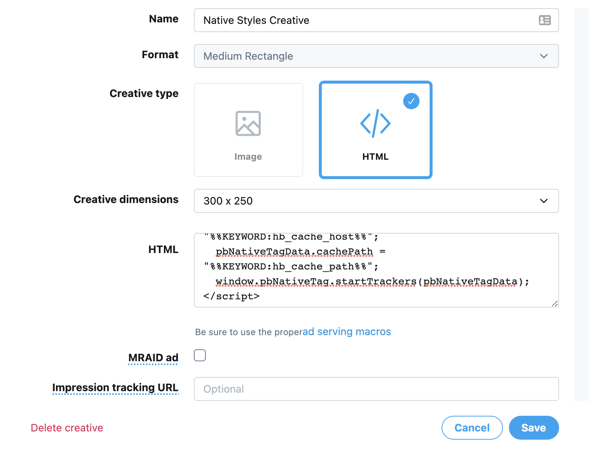
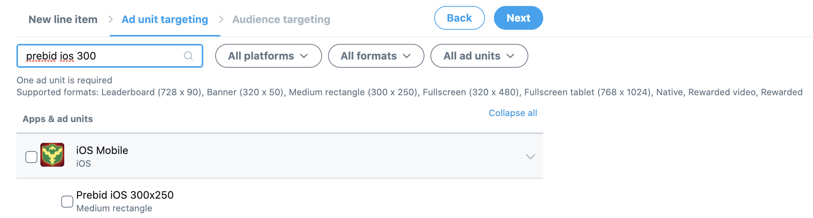
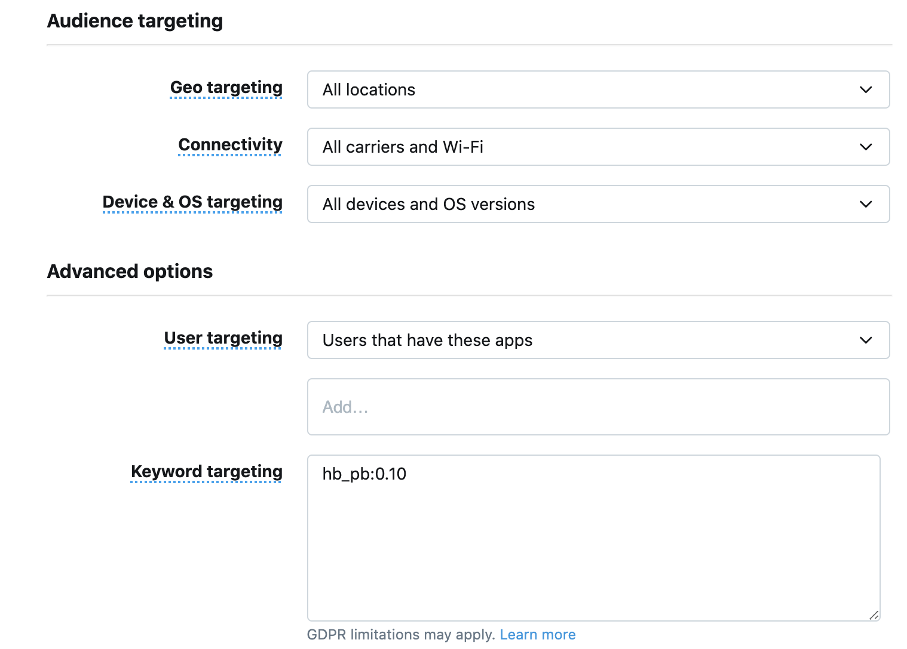

# MoPub Setup

## Overview

The sense of prebid technology is to run the header bidding auction first and inject an opportunity to display a winning bid into a preconfigured waterfall on the Primary Ad Server. This could be achieved by adding special Line Items which point to the prebid creative. If such line item wins on the primary ad server the prebid ad will be rendered on the client, otherwise, the ad from the predefined waterfall will be rendered.

This scenario is totally supported by Prebid Rendering SDK.

So the essential part of Prebid integration is creating a special Line Items on the MoPub.

## Best Practises 

From the very beginning publishers should pay attention to the Best Practices of configuring orders on the Primary Ad Server. It will help to improve monetization from the first steps. 

In order to get the best revenue publishers have to create Line Items with unique price targets according to the [price granularity](http://prebid.org/prebid-mobile/adops-price-granularity.html#autoGranularityBucket) policy. That means that it is necessary to create more than one hundred line items to get the best coverage.

Publishers can do it by hands, develop special scripts, or using some tool for generating orders like [PubMonkey](https://chrome.google.com/webstore/detail/pubmonkey/cjbdhopmleoleednpeaknmmbepfkhaml?hl=en)
 
## Order Setup

### Step 1: Create New Order

 
 
### Step 2: Create Line Item
 
#### Line Item: Display, Video

To integrate the In-App Bidding into your app you have to create a Custom Ad Network Line Item with a specific Targeting keyword. Note that `Custom Ad Network` type is not suitable for Native Style Ads, see [Native Style Line Item and creative](#line-item-native) for more details.

Regardless of the ability to name a Line Item in any way we strongly suggest using the price or targeting keyword in the name. It will help you when you will create a hundred of them.

- **Line Item Name**: hb_pb 0.10
- **Type & Priority**: Network Line Item
- **Network**: Custom SDK network
- **Custom event class**: 
    - For Banner API: **PrebidBannerAdapter**
    - For Interstitial API: **PrebidInterstitialAdapter**
    - For Rewarded API: **PrebidRewardedVideoAdapter**
    - For Native API: **PrebidNativeAdapter**
- **Custom event data**: {}



#### Line Item: Native

If you integrate Native Ads not via mediation you should create regular line tiems



After that you should create a custom Native creative with **obligatory** property **isPrebid** and value **1**.



This property will show Prebid Rendering SDK that it should render the ad from the winning bid.

#### Line Item: Native Style

Native styles ads are using `non-guaranteed` line item type and Medium Rectangle format HTML creative.



MoPub 300x250 Medium Rectangle format HTML creative example:



``` html
<div class="sponsored-post">
  <div class="thumbnail"></div>
  <div class="content" class="pb-click">
	<h2><p><span style="display:inline-block;"></span> hb_native_title</p></h2>
	<p>hb_native_body</p>
	<a target="_blank" href="hb_native_linkurl" class="pb-click">hb_native_cta</a>
	
	<div class="attribution">hb_native_brand</div>
  </div>
</div>
<script src="https://cdn.jsdelivr.net/npm/prebid-universal-creative@latest/dist/native-trk.js"></script>
<script>
  var pbNativeTagData = {};
  pbNativeTagData.uuid = "%%KEYWORD:hb_cache_id%%";
  pbNativeTagData.env = "%%KEYWORD:hb_env%%";
  pbNativeTagData.cacheHost = "%%KEYWORD:hb_cache_host%%";
  pbNativeTagData.cachePath = "%%KEYWORD:hb_cache_path%%";
  window.pbNativeTag.startTrackers(pbNativeTagData);
</script>
```
 
#### Ad Unit Targeting



#### Audience Targeting

The **Keyword targeting** property should contain a special keyword with the price of winning bid.




