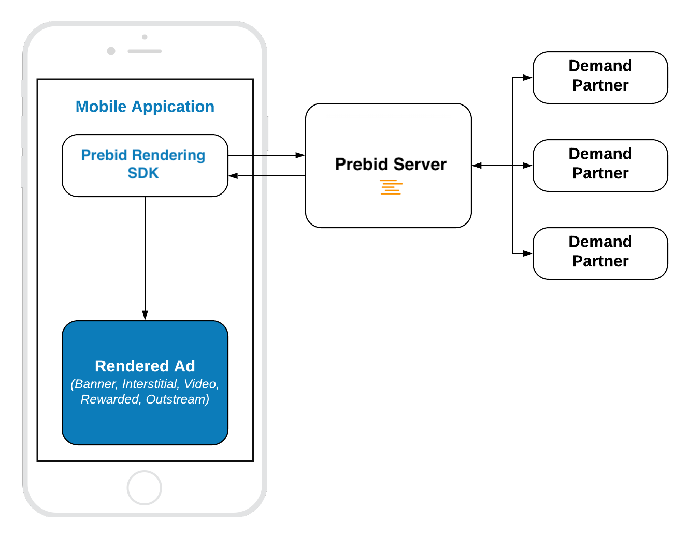

# Pure In-App Bidding Integration

## Table of Contents

- [Mobile API](#mobile-api)
- [Banner](#banner-api)
- [Interstitial](#interstitial-api)
- [Rewarded](#rewarded-api)

## Mobile API

The [integration](../android-sdk-integration.md) of Pure In-App Bidding is similar to the integration of any other regular Ad SDK. 



Prebid Rendering Module provides ability to integrate  these ad formats:

- Display Banner
- Display Interstitial
- Video Interstitial 
- Rewarded Video
- Outstream Video
- [Native Styles](android-in-app-bidding-prebid-native-integration.md)

However, the  Rendering Module provides only three kinds of API classes for these ads:

- **Banner API** - for **Display** and **Video**  Banners
- **Interstitial API** - for **Display** and **Video** Interstitials
- **Rewarded API** - for **Rewarded Video**

### Banner API

To display an ad you need to implement these easy steps:


``` kotlin
// 1. Create an Ad View
bannerView = BannerView(requireContext(), configId, adSize)
bannerView?.setBannerListener(this)

// Add view to viewContainer
viewContainer?.addView(bannerView)

// 2. Load ad
bannerView?.loadAd()
```

#### Step 1: Create Ad View

In the Pure In-App Bidding scenario you just need to initialize the Banner Ad View with correct properties:

- **configId** - an ID of Stored Impression on the Prebid server.
- **size** - the size of the ad unit which will be used in the bid request.

And assign the listener for processing ad events.

#### Step 2: Load the Ad

Simply call `loadAd()` and SDK will:

- make bid request to Prebid
- render the winning bid on display

#### Outstream Video

For **Outstream Video** you also need to specify video placement type of the expected ad:

``` kotlin
bannerView.videoPlacementType = PlacementType.IN_BANNER // or any other available type
```

### Interstitial API

To display an ad you need to implement these easy steps:


``` kotlin
// 1. Create an Interstitial Ad Unit
interstitialAdUnit = InterstitialAdUnit(requireContext(), configId, minSizePercentage)
interstitialAdUnit?.setInterstitialAdUnitListener(this)

// 2. Load Ad
interstitialAdUnit?.loadAd()
// .....

// 3. Show the ad
interstitialAdUnit?.show()
```

The way of displaying **Video Interstitial Ad** is almost the same with two differences:

- Need customize the ad unit format.
- No need to set up `minSizePercentage`.

``` kotlin
// 1. Create an Interstitial Ad Unit
interstitialAdUnit = InterstitialAdUnit(requireContext(), configId, AdUnitFormat.VIDEO)
interstitialAdUnit?.setInterstitialAdUnitListener(this)

// 2. Load Ad
interstitialAdUnit?.loadAd()

// .....

// 3. Show the ad
interstitialAdUnit?.show()
```


#### Step 1: Create an Ad Unit


In the Pure In-App Bidding scenario you just need to initialize the Interstitial Ad Unit with correct properties:

- **configId** - an ID of Stored Impression on the Prebid server
- **minSizePercentage** - specifies the minimum width and height percent an ad may occupy of a device’s real estate.

Also you can assign the listener for processing ad events.

> **NOTE:** minSizePercentage - plays an important role in a bidding process for display ads. If provided space is not enough demand partners won't respond with the bids.

#### Step 2: Load the Ad

Simply call the `loadAd()` method to start [In-App Bidding](../android-in-app-bidding-getting-started.md) flow.


#### Step 3: Show the Ad when it is ready

The most convenient way to determine if the ad is ready for displaying is to subscribe to the particular litener method:

``` kotlin
override fun onAdLoaded(interstitialAdUnit: InterstitialAdUnit) {
    //Ad is ready for display
}
```

### Rewarded API

To display an ad you need to implement these easy steps:


``` kotlin
// 1. Create an Ad Unit
rewardedAdUnit = RewardedAdUnit(requireContext(), configId)
rewardedAdUnit?.setRewardedAdUnitListener(this)
    
// 2. Execute ad load
rewardedAdUnit?.loadAd()

/// .......

// After ad is loaded you can execute `show` to trigger ad display
rewardedAdUnit?.show()
```

To be notified when a user earns a reward - implement the `RewardedAdUnitListener` interface. For now this method will be called when the ad is completed.

``` kotlin
fun onUserEarnedReward(rewardedAdUnit: RewardedAdUnit)
```

#### Step 1: Create Rewarded Ad Unit

Create the **RewardedAdUnit** object with parameters:

- **adUnitId** - an ID of Stored Impression on the Prebid server.

#### Step 2: Load the Ad

Simply call the `loadAd()` method to start [In-App Bidding](../android-in-app-bidding-getting-started.md) flow.


#### Step 3: Show the Ad when it is ready


The most convenient way to determine if the ad is ready for displaying is to subscribe to the particular listener method:

``` kotlin
override fun onAdLoaded(rewardedAdUnit: RewardedAdUnit) {
//Ad is ready for display
}
```


